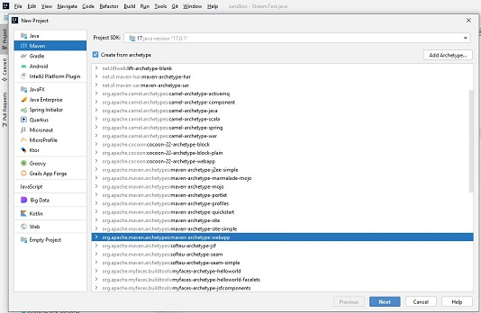
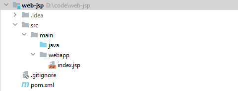
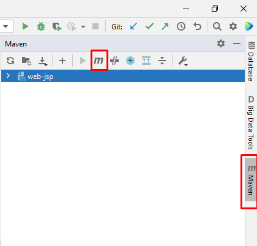
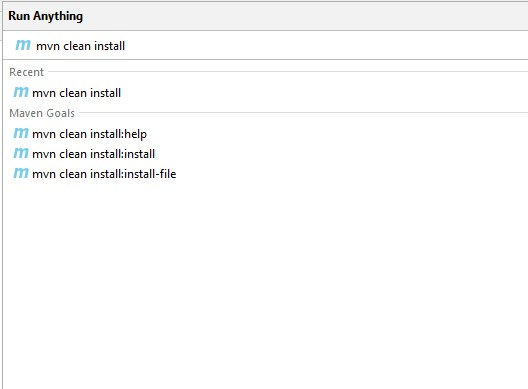
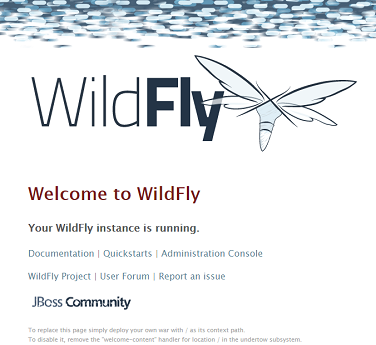
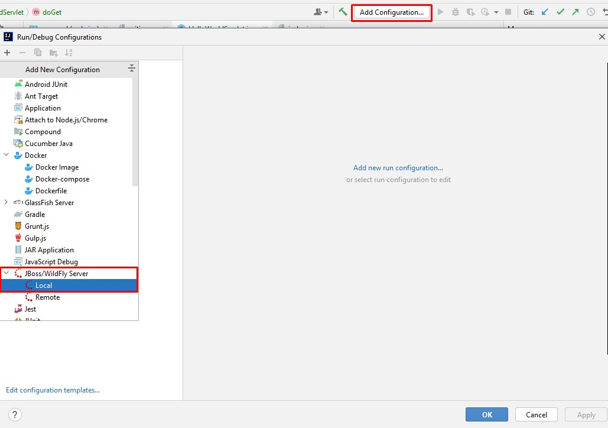
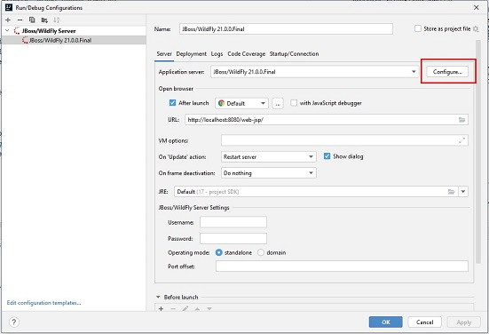
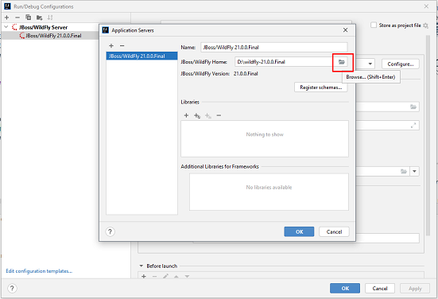
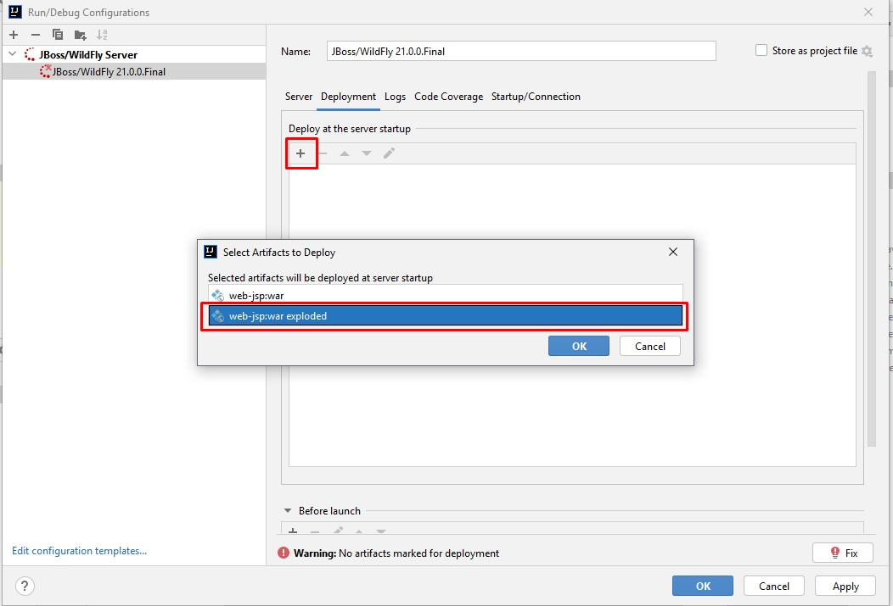

### Содержание:
1. Инициализация JSP-приложения. 
2. Сборка Web Application Archive (war) с помощью Maven. 
3. Развертывание war на веб-сервере WildFly на локальной машине.
4. Интеграция WildFly в Intellij IDEA.
5. Развертывание на удаленном хосте helios.

### Инициализация JSP-приложения
1. Первым шагом создадим новый Maven проект в IntelliJ IDEA с архетипом webapp. <br>
   
2. Добавим классы согласно структуре, указанной на изображении. <br>
   

4. Добавим зависимости в pom.xml.
```
   <dependency>
           <groupId>javax</groupId>
           <artifactId>javaee-web-api</artifactId>
           <version>7.0</version>
           <scope>provided</scope>
       </dependency>
       <dependency>
           <groupId>jstl</groupId>
           <artifactId>jstl</artifactId>
           <version>1.2</version>
       </dependency>
   </dependencies>
```

5. В файле index.jsp напишем следующий простой html: 
```
<html>
   <body>
      Hello world!
   </body>
</html>
```
6. В директории src/main/java создадим класс HelloWorldServlet. 
```
import javax.servlet.ServletException;
import javax.servlet.http.HttpServlet;
import javax.servlet.http.HttpServletRequest;
import javax.servlet.http.HttpServletResponse;
import java.io.IOException;

public class HelloWorldServlet extends HttpServlet {

    @Override
    protected void doGet(HttpServletRequest request, HttpServletResponse response) throws IOException, ServletException {
        getServletContext().getRequestDispatcher("/index.jsp").forward(request, response);
    }
}
```
HelloWorldServlet расширяет HttpServlet, реализуя метод _doGet(HttpServletRequest request, HttpServletResponse response)_: при обращении на рутовый url приложение вернет страницу index.jsp.

### Сборка war с помощью Maven

Если вы еще не сталкивались с инструментами сборки, вам необходимо установить [Maven](https://maven.apache.org/download.cgi) на свой компьютер или воспользоваться встроенным в IntelliJ IDEA. 

Если вы решите использовать встроенный в среду разработки Maven, вам нужно открыть вкладку Maven в правом углу IntelliJ IDEA, нажать на букву _m_ и в появившимся окне ввести команды.

 
 

1. Для сборки war выполним команду:
```
mvn clean install
```
2. Убедимся в успешности сборки, увидев в консоле BUILD SUCCESS, и, проверив в появившейся директории файл с названием проекта и расширением .war 

### Деплой war-ника на WildFly на локалке

1. Скачиваем zip-архив [Wildfly](https://www.wildfly.org/downloads/#21.0.0.Final) (имхо 21-я версия стабильнее работает на helios). Делаем разархивацию и переносим программу в удобный каталог. 
2. Добавляем пользователя. Это важный пункт, так как без него веб-сервер не задеплоит сборку. Заходим в директорию _wildfly-21.0.0.Final\bin_ и запускаем скрипт add-user.bat (для Windows) или add-user.sh (для Linux, MacOS). 
3. Убедимся, что сервер работает. 
   - Заходим в директорию _wildfly-21.0.0.Final\bin_ и запускаем скрипт _standalone.bat_ (для Windows) или _standalone.sh_ (для Linux, MacOS).  
   - Открываем браузер и переходим по url http://localhost:8080.
   - Видим домашнюю страницу Wildfly, значит сервер работает. <br>

   <br>
   <br>
4. Запускаем сервер со своим war.
   - Заходим в директорию _wildfly-21.0.0.Final\standalone\deployments_ и переносим туда ранее собранный war-ник.
   - Заходим в директорию _wildfly-21.0.0.Final\bin_ и запускаем скрипт _standalone.bat_ (для Windows) или _standalone.sh_ (для Linux, MacOS). 
   - Открываем браузер и переходим по url http://localhost:8080/war_name (в моем примере http://localhost:8080/web-jsp) .
   - Видим «Hello World!».

### Интеграция WildFly в Intellij IDEA.

1. В Intellij IDEA добавляем конфигурацию для проекта, выбираем JBoss/Wildfly Server Local. <br>

2. Настроим конфигурацию и укажем директорию, где лежит веб-сервер.<br>

3. Переходим во вкладку Deployment, нажимаем на знак «+» и выбираем war_name.war:exploded.<br>

4. Сохраняем конфигурацию. Теперь можно разворачивать приложения в среде разработки.<br>


### Развертывание на удаленном хосте helios

1. Закидываем WildFly в домашнюю директорию на helios.
2. Открываем файл standalone.xml по пути _standalone/configuration/standalone.xml_. В этом файле меняем:
---

```
 <interface name="public">
      <inet-address value="${jboss.bind.address:127.0.0.1}" />
    </interface>
```
на
```
<interface name="public">
<any-address />
</interface>
```
---

```
 <socket-binding name="http" port="${jboss.http.port:8080}" />
 <socket-binding name="https" port="${jboss.https.port:443}"/>
```
на
```
 <socket-binding name="http" port="${jboss.http.port:<portbase>}"/>
 <socket-binding name="https" port="${jboss.https.port:<portbase + n>}"/>
```
! где **portbase** - число из гугл-журнала, также можно добавить к нему число от 1 до 99, т.к. portbase выдают с расчётом, что 99 портов, идущие после него, тоже ваши.

---

3. Подключимся к helios, пробросив порты с помощью команды:
```
ssh -p 2222 s******@helios.cs.ifmo.ru -L 8080:helios.cs.ifmo.ru:<portbase>
```   
аргумент ssh команды -L означает, что порт на локальном хосте должен быть перенаправлен на указанный хост и
порт на удаленной стороне.

4. Запустим сервер с помощью таких же команд как и на локальной машине.
5. Переходим в браузере по url http://localhost:8080/war_name.

! Если вы закидываете тот же WildFly, что и подключали в Intellij IDEA, то удалите тег ```<deployments>...</deployments>``` в _Standalone.xml_.
